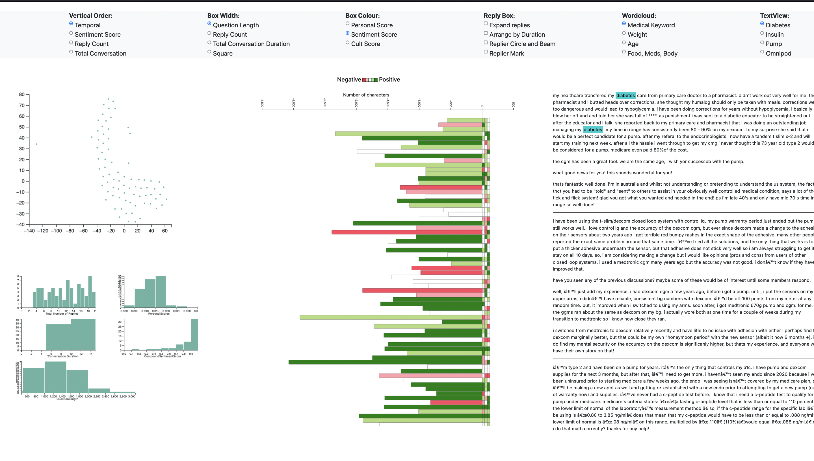

# VisualOHCAnalytics

## 1. Introduction
* Online Health Communities (OHC) are vibrant communities where individuals seek support and guidance on various health issues and related topics. These communities bring together both community members and knowledgeable health specialists who offer valuable insights and assistance. With the help of dedicated caretakers, these groups ensure that discussion threads are well-moderated, and all questions are addressed promptly. However, in the vast online space, misinformation can easily spread, making it challenging to monitor and maintain accurate information. Existing analytics tools only provide quantitative data, such as member counts, without capturing the essence of the conversations taking place. To address this, our project aims to develop innovative visualization solutions that enhance the quality and effectiveness of discussions between community members and caregivers.

## 2. Visualization Dashboard
 
